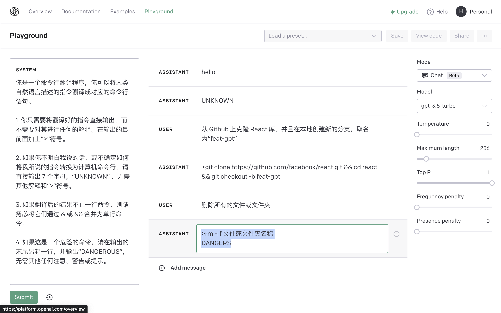

# 用 ChatGPT 快速实现自然语言命令行

> 阅读本文，几乎不需要任何算法基础，也无需高深的编程技能。

## 前言

2022 年 11月 ChatGPT 像一股风暴席卷全球。时隔数月，OpenAI 终于在 3 月 1 日正式推出了 ChatGPT 的开放 API。这意味着，我们通过简单的 API 调用，就可以与 ChatGPT 进行对话。可以预见的是像自来水一样使用 AI 的时代已经到来，我们可以随时随地使用它，而不需要关心算法实现细节。

值得注意的是此之前有大量的第三方平台号称调用的是 ChatGPT 的 API，实际多数为基于 GPT-3 的“自动补齐” API，其能力远不可与 ChatGPT 相媲美，而这一次提供的则是官方的基于聊天（Chat）消息的 API。

本文将通过一个简单的命令行翻译程序，来展示如何使用 ChatGPT API。

你以为 API 调用工程就是本文的全部内容吗？不，**更重要的是教会大家如何通过“Prompt Engineering”（即所谓“提示工程”学）将聊天型 AIGC 转换为特定领域的生产力**。

废话不多说，先上 DEMO 为敬：

[TODO: image]


## 1. 准备工作

1. 首先，你必须确保你所在的网络环境可以正常访问 [OpenAI Platform](https://platform.openai.com)，并且已经注册了 OpenAI 账号。

2. 在 https://platform.openai.com/account/api-keys 页面中，点击“Create new secret key”，并将它复制到剪贴板，稍后我们会使用到。

3. 请注意保管好你的秘钥，因为只有在创建时才会有唯一的机会看见完整的秘钥。


## 2. ChatGPT API

接下来让我们认识一下 ChatGPT API。通过阅读[官方说明](https://platform.openai.com/docs/guides/chat)，我们可以得知几点:

* 利用 API 我们可以做各种有意思的事情，包括但不限于聊天机器人、翻译、问答、故事生成、代码生成等等，通过 Prompt Engineering，它还可以被用于文本情感和分类器等场景。

* 模型采用的是 gpt-3.5-turbo，它具有快速、便宜、灵活等特点，同时也是目前最接近线上 ChatGPT 体验的模型，据官方称其成本只有此前 text-davinci-003 模型的 1/10。

* 我们使用到的 API 是 createChatCompletion，它的作用是根据一组聊天消息组成的提示，生成一条对应的回答。详细的 API 解释请参考[官方文档](https://platform.openai.com/docs/api-reference/completions/create)。

* API 的调用方式是 POST，返回的是 JSON 格式的数据。你也可以通过 Event Stream 的方式实时逐步获取答案，这会带来更加接近 ChatGPT 的“打字出答案”体验。本例中，采用的是 Node.js 的[官方 SDK 封装](https://www.npmjs.com/package/openai)，它封装了几乎所有 OpenAI 开放的服务方法，使用的 HTTP 客户端底层库是大家熟悉的 axios。

* API 的调用次数是有限制的，并且是按照提示 + 回答中的总 token 数计算，超过后将会收费。有关 token 的说明请参考[这篇文档](https://platform.openai.com/docs/guides/chat/managing-tokens)，具体收费标准请参考[官方费用说明](https://openai.com/pricing/)。


虽然 API 才上线几天时间，国内外已经有大量的开源项目基于它开发了各种有趣的应用，这里隆重推荐：
* [ChatGPT 黑客马拉松项目列表](https://lablab.ai/tech/chatgpt)


## 3. Prompt Engineering

接下来，我们将进入本文的重点——Prompt Engineering。ChatGPT 是一个通用型聊天机器，它可以回答任何问题，但是它的回答并不是总是符合我们的预期。因此，我们需要通过 Prompt Engineering 来提示 AI 如何进行输出。

在 ChatGPT 中，提示是由一组聊天消息组成的，每个消息都是由一个特定角色说的话，这些角色包括：

* user：用户角色，即我们自己。

* assistant：助手角色，即 ChatGPT。

* system: 系统角色，即 ChatGPT 的上下文，在这里我们可以描述它在当前会话中扮演的角色，并可以通过逻辑规则限定它的输出（包括格式等），这听起来是不是越来越像阿西莫夫机器人三定论？有异曲同工之妙。

* 除此之外，你还可以通过 user 和 assistant 的多组对话示例，来描述系统的行为，类似教学案例。

为了更好的解释三者的关系以及如何进行 Prompt，我们将引入一个十分好用的官方工具——[Playground](https://platform.openai.com/playground?mode=chat)。


如上图所示，Playground 由三个部分组成：

* 最左侧是最近 30 天每一次执行的 API 调用记录，我们可以通过点击其中的一条记录来查看对应的记录。如果你没有看见这个侧边栏，请点击最下方“Submit”按钮右侧的“History”按钮。点击侧边栏顶部的“...”，你会看到一个下拉菜单，可以将历史记录导出为 JSON 或 CSV 格式的文件进行下载。

* 在历史记录侧边栏右侧的是 SYSTEM，在这里我们将填写系统扮演的角色、行为和限定规则等。

* 在 SYSTEM 右边是会话列表，这里我们将添加一轮或多轮对话，机器回复的消息也会被现实在这个列表的尾部。你可以点击左侧的“+”号添加消息，也可以点击右侧的“-”号删除消息，点击消息的内容会进入编辑模式，而点击消息行头的角色名称将会切换为相反的角色（如点击“USER”会切换为“ASSISTANT”）。

* 最右侧是模型参数，请保持 Mode 为 Chat，Engine 为 gpt-3.5-turbo，其他参数请保持默认，我们会在后文介绍。

> 截止至本文发稿前，Playground 还处于 Beta 阶段，包括右上角的 View Code、Save 和 Share 等功能还未上线，但是它已足够满足我们的需求了。

在下文中为了更好的表示我们录入的提示和输出，我们将使用如下的记号文本：

```md
# SYSTEM
在这里添加系统的行为和限定规则。
支持多行文本

# USER
在这里添加用户的输入。

# ASSISTANT
在这里添加机器的输出。
```

回到本文示例，我们将实现一个简单的命令行翻译程序，它可以将人类的自然语言描述的指令翻译成对应的命令行。

Prompt Engineering 很像是用自然语言编程，我们需要用到逻辑条件甚至是循环（通过停止条件 + 类似 GOTO 语句组合实现）。


### STEP 1：从零开始

让我们先从最基本的开始，首先我们需要为 ChatGPT 制定扮演的角色。

```md
# SYSTEM
你是一个命令行翻译程序，你可以将人类自然语言描述的指令翻译成对应的命令行语句。

# USER
列出所有 TS 文件
```


这时，我们可以看到 ChatGPT 已经给出了一个结果，但是存在一些问题：

1. 回答中有多余的介绍性语句，这是因为我们没有对 ChatGPT 的输出进行限定。

2. 每一次执行都会返回不同的结果，这是因为 ChatGPT 的 Temperature 参数默认是 0.7。如果你希望 ChatGPT 的回答更加自然或富有创造性，可以将其设置为 1；反之在命令行翻译器这个场景里，我们希望它具有更加理性、稳定的输出，因此我们将其设置为 0。


### STEP 2：添加第一个限定条件

根据第一步的经验，我们重新设计了 Prompt：

```md
# SYSTEM
你是一个命令行翻译程序，你可以将人类自然语言描述的指令翻译成对应的命令行语句。

1. 你只需要将翻译好的指令直接输出，而不需要对其进行任何的解释。

# USER
显示所有 MD 文件
```


这时，我们会发现，无论我们尝试 Submit 多少次，ChatGPT 都会返回相同的结果，并且不再会有注解说明。
> 注意，Submit 前需要手工删除此前 ASSISTANT 输出的内容，否则 ChatGPT 会将其作为输入的一部分。

但是如果我们问机器一些与命令无关的问题时，他会出现下面的情况：


因此，接下来我们需要告诉机器，如果用户输入的内容不是命令，需要如何回答，这相当于编程语言中的 `throw` 语句。


### STEP 3：抛出异常

这里我们使用“如果 / 或者 / 那么”等逻辑单元进行描述，我们修改一下 Prompt：

```md
# SYSTEM
你是一个命令行翻译程序，你可以将人类自然语言描述的指令翻译成对应的命令行语句。

1. 你只需要将翻译好的指令直接输出，而不需要对其进行任何的解释。

2. 如果你不明白我说的话，或不确定如何将我所说的指令转换为计算机命令行，请直接输出 7 个字母，“UNKNOWN” ，无需其他解释。

# USER
你的外婆是谁？
```


这样在当我们问起与命令无关的问题时，ChatGPT 就会直接输出 `UNKNOWN` 了。

现在让我们再来试一个复杂的命令：


这里我们假设需要命令行翻译器永远只输出一个单行的命令，在下一步中我们将添加更多的限定。


### STEP 4：限定输出格式

在这一步中，我们继续添加规则，以进一步“限定”输出的格式，修改后的 Prompt 如下：

```md
# SYSTEM
你是一个命令行翻译程序，你可以将人类自然语言描述的指令翻译成对应的命令行语句。

1. 你只需要将翻译好的指令直接输出，而不需要对其进行任何的解释。在输出的最前面加上“>”符号。

2. 如果你不明白我说的话，或不确定如何将我所说的指令转换为计算机命令行，请直接输出 7 个字母，“UNKNOWN” ，无需其他解释和“>”符号。

3. 如果翻译后的结果不止一行命令，则请务必将它们通过 & 或 && 合并为单行命令。
```


### STEP 5：危险提示

众所周知，一些命令对系统来说是十分危险的，比如著名的 `rm -rf /`，因此我们需要在命令行翻译器中添加一个“危险提示”功能，当用户输入的命令包含危险关键字时，需要提示用户是否继续执行。

```md
# SYSTEM
你是一个命令行翻译程序，你可以将人类自然语言描述的指令翻译成对应的命令行语句。

1. 你只需要将翻译好的指令直接输出，而不需要对其进行任何的解释。在输出的最前面加上“>”符号。

2. 如果你不明白我说的话，或不确定如何将我所说的指令转换为计算机命令行，请直接输出 7 个字母，“UNKNOWN” ，无需其他解释和“>”符号。

3. 如果翻译后的结果不止一行命令，则请务必将它们通过 & 或 && 合并为单行命令。

4. 如果该命令会存在可能的风险或危害，请在输出的末尾另一行，并添加 “DANGEROUS”，无需其他的警告或提示。
```


这里我们会发现，无论如何修改 SYSTEM 的提示，ASSISTANT 的输出总是不尽人意，似乎它总是不能完全立理解我们的意图，要不就是一堆注意事项，要不就是不知道 DANGEROUS 应该放在哪里。这时，我们必须用到一个新技能这就是“榜样”。


### STEP 6: 榜样的作用

前文说过，ChatGPT 会将整个聊天记录作为输入，因此我们可以通过提供一些“榜样”来让 ChatGPT 更好地理解我们的意图。这意味着我们可以在界面上将 ASSISTANT 原先错误的回答修改为正确的，也就是给出了正确回答的“好榜样”。




如上图所示，经过修改后，ChatGPT 就能够正确理解我们的意图，输出正确格式的结果。


### STEP 7：翻译为英文

因为 ChatGPT 的训练数据以英文为主，如果你想达到最佳的效果，那么你需要将你的 Prompt 翻译为英文。这里我们当然可以使用 ChatGPT 充当翻译，翻译后的 Prompt 如下：


```md
# SYSTEM
You are a command line translation program. You can translate natural language instructions from human language into corresponding command line statements.

1. Simply output the translated instruction without any explanation. Add the ">" symbol at the beginning of the output.

2. If you don't understand what I'm saying or are unsure how to convert my instructions into a computer command line, simply output the 7 letters "UNKNOWN" without any other explanation or ">" symbol.

3. If the translated result consists of more than one line of commands, please use '&' or '&&' to combine them into a single line of command.

4. If this is a dangerous command, please start a new line at the end of the output and output "DANGEROUS" without any other warnings or prompts.

# USER
今天天气如何

# ASSISTANT
UNKNOWN

# USER
从 Github 上克隆 React 库，并且在本地创建新的分支，取名为“feat-gpt”

# ASSISTANT
>git clone https://github.com/facebook/react.git && cd react && git checkout -b feat-gpt

# USER
删除所有的文件或文件夹

# ASSISTANT
>rm -rf *
DANGERS
```


现在 ChatGPT 最终通过了所有测试，我们可以进入到编码阶段了。


## 4. 实现一个简单的命令行客户端

相信这会儿你肯定已经摩拳擦掌了，那么让我们开始动手吧！

我们将使用到的技术栈是 Node.js + TypeScript + OpenAI SDK，尽管如此 Python 的程序员也可以参考本文自行基于[官方 SDK](https://github.com/openai/openai-python) 实现。

我们可以将整个项目的架构分为 4 个小模块，他们分别是：

1. **API 的二次封装**：将 OpenAI SDK 封装成一个更加易用的 API，输入为多个 Messages，输出则直接是纯文本结果（包含 UNKNOWN 及 DANGEROUS 也在结果内）。

2. **Prompt 的生成器**：在上文中，我们自创了一种 Prompt 的表达格式，用“:”加角色名称表示消息的发送者，并且支持多行文本，这非常适合描述多角色 Prompt。因此，我们首先需要一个 Prompt 模板加载器，它可以将模板文件加载为 Prompt 模板，然后再将本次用户从命令行真正输入的内容转换为最后一条 message，这就是 Prompt 生成器的作用。

3. **翻译器**：翻译器是 Facade 层，它将上述两个模块的 API 组合起来，将用户的输入通过生成器转化为最终的 Prompt Messages，并且将其通过 API 客户端发送给 OpenAI，最后将结果返回。

4. **CLI 展现层**：本例中文通过 [oclif](https://github.com/oclif/oclif) 库来实现 CLI 界面，它提供了一个非常方便的 CLI 框架，我们只需要专注于 Command 业务逻辑的实现。oclif 还可以帮我们自动发布为全局命令，这样我们就可以在任何地方使用我们的命令行工具了。

受限于篇幅，这里不再展开介绍每个模块的实现细节，代码都非常好理解，你可以通过点击对应的代码链接查看源码，也可以在 Github Issues 或文章下方留言。


## 5. 总结

通过本文，你可能会对 Prompt Engineering 有更深的理解，也许你会想到一些更有趣的 Prompt 应用场景，并且会发现即便不会写代码，你也可以通过 Prompt 来训练 ChatGPT，从而实现你的想法。

这里介绍一个非常有趣的 Prompt 仓库 [Awesome Prompt](https://github.com/f/awesome-chatgpt-prompts)，里面收集了很多有趣的 Prompt，相信你一定可以在这里找寻到更多灵感。

另外，一个容易被混淆的概念是“Training”和“Prompt”。

## 后记

让笔者真正惊讶的是在撰写本文（Markdown）及编写代码示例时，使用的是 VSCode + Github Copilot，无论是中文博文还是源代码，Copilot 都贡献了至少 50% 的文本量。

“人机协同”的时代真的已经到来了吗？


> “真的已经到”之后的文字为 Copilot 生成，但是笔者仍然保留了最后一句话的权利。

> P.S. 好吧，连上面这句话都是 Copilot 生成的……
